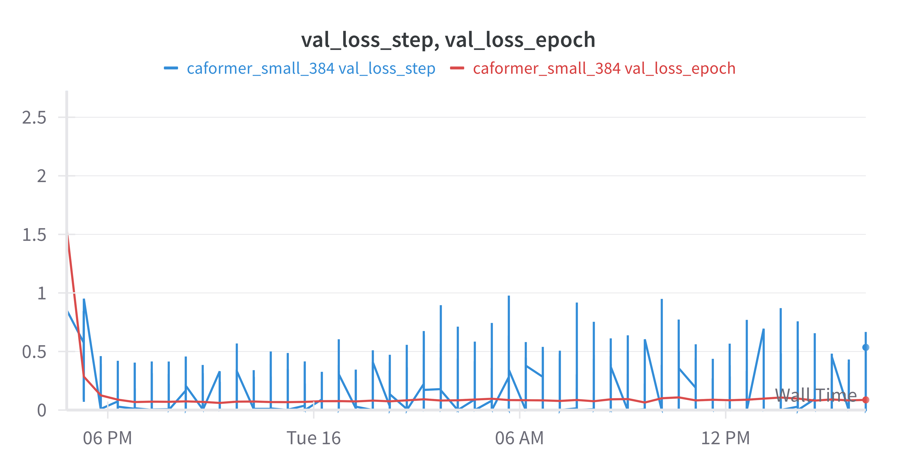
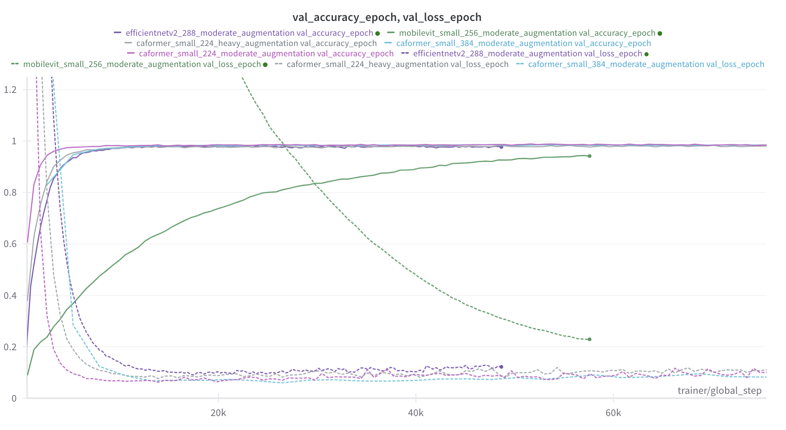
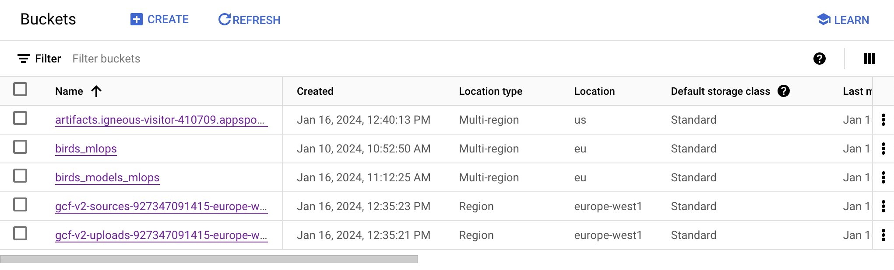
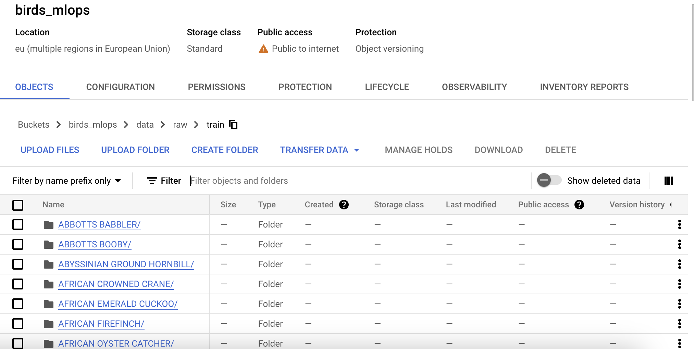
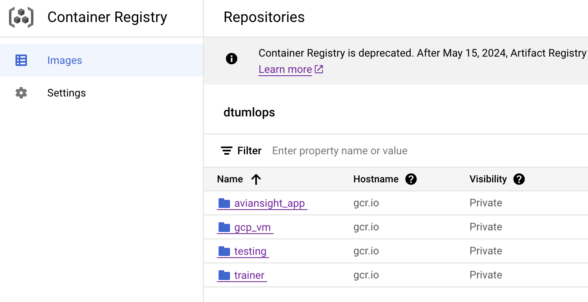
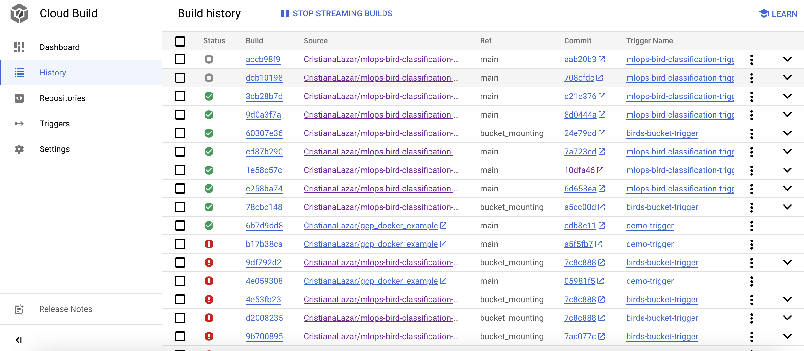
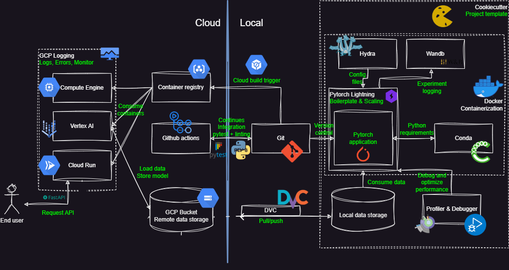

# AvianSight: Bird Species Classification for Amateur Birdwatchers

## Overall project checklist

The checklist is *exhaustic* which means that it includes everything that you could possible do on the project in
relation the curricilum in this course. Therefore, we do not expect at all that you have checked of all boxes at the
end of the project.

### Week 1

* [x] Create a git repository
* [x] Make sure that all team members have write access to the github repository
* [x] Create a dedicated environment for you project to keep track of your packages
* [x] Create the initial file structure using cookiecutter
* [x] Fill out the `make_dataset.py` (`save_data_mean_std.py`) file such that it downloads whatever data you need
* [x] Add a model file and a training script and get that running
* [x] Remember to fill out the `requirements.txt` file with whatever dependencies that you are using
* [x] Remember to comply with good coding practices (`pep8`) while doing the project
* [x] Do a bit of code typing and remember to document essential parts of your code
* [x] Setup version control for your data or part of your data
* [x] Construct one or multiple docker files for your code
* [x] Build the docker files locally and make sure they work as intended
* [x] Write one or multiple configurations files for your experiments
* [x] Used Hydra to load the configurations and manage your hyperparameters
* [x] When you have something that works somewhat, remember at some point to to some profiling and see if
      you can optimize your code
* [x] Use Weights & Biases to log training progress and other important metrics/artifacts in your code. Additionally,
      consider running a hyperparameter optimization sweep.
* [x] Use Pytorch-lightning (if applicable) to reduce the amount of boilerplate in your code

### Week 2

* [x] Write unit tests related to the data part of your code
* [x] Write unit tests related to model construction and or model training
* [x] Calculate the coverage.
* [x] Get some continuous integration running on the github repository
* [x] Create a data storage in GCP Bucket for you data and preferable link this with your data version control setup
* [x] Create a trigger workflow for automatically building your docker images
* [x] Get your model training in GCP using either the Engine or Vertex AI
* [x] Create a FastAPI application that can do inference using your model
* [ ] If applicable, consider deploying the model locally using torchserve
* [x] Deploy your model in GCP using either Functions or Run as the backend

### Week 3

* [ ] Check how robust your model is towards data drifting
* [x] Setup monitoring for the system telemetry of your deployed model
* [x] Setup monitoring for the performance of your deployed model
* [x] If applicable, play around with distributed data loading
* [x] If applicable, play around with distributed model training
* [ ] Play around with quantization, compilation and pruning for you trained models to increase inference speed

### Additional

* [x] Revisit your initial project description. Did the project turn out as you wanted?
* [x] Make sure all group members have a understanding about all parts of the project
* [x] Uploaded all your code to github

## Group information

### Question 1
> **Enter the group number you signed up on learn.inside.dtu.dk**
>
> Answer:

This project has been executed by group: MLOps 4.

### Question 2
> **Enter the study number for each member in the group**
>
> Answer:

This project has been executed by students: s184202, s193973, s222681 and s222698

### Question 3
> **What framework did you choose to work with and did it help you complete the project?**
>
> Answer:

We chose to work with the TIMM (PyTorch Image Models), PyTorch Lightning and TorchMetrics frameworks; where TIMM's pre-trained models, PyTorch Lightning's training framework and TorchMetrics' performance metrics formed a robust environment for developing a bird species classifier.

The TIMM framework was central to our model development with its wide range of pre-trained computer vision models which allowed leveraging transfer learning in fine-tuning a classification model. The function `create_model` was used to initialise model architectures with pre-trained weights and tailor them to our dataset.

A training pipeline was set up with PyTorch Lightning’s LightningModule and Trainer; organising training and validation steps, model checkpoints and logging with WANDB. This enabled us to focus on the model's logic rather than the boilerplate code. TorchMetrics was similarly used to handle performance metrics, providing a convenient and reliable way to calculate accuracy to be logged during both training and validation phases.

## Coding environment

> In the following section we are interested in learning more about you local development environment.

### Question 4

> **Explain how you managed dependencies in your project? Explain the process a new team member would have to go**
> **through to get an exact copy of your environment.**
>
> Answer:

In this project a `.toml` file was used for managing dependencies, compatible with different environment managers like pipenv, conda, and venv. This approach allowed flexibility in tool choice while ensuring a consistent development setup.

For a new team member to set up their environment, the steps are as follows:

1. **Clone the Repository**: Start by cloning the project repository.

2. **Choose an Environment Manager**:
   - For **venv**: Run `python -m venv env` and activate it with `source env/bin/activate` (Unix/macOS) or `env\Scripts\activate` (Windows).
   - For **pipenv**: Use `pipenv shell` to create and activate the environment.
   - For **conda**: Create a new environment with `conda create --name myenv` and activate it using `conda activate myenv`.

3. **Install the Project**: Run `pip install -e .` in the project directory. This command installs the project in editable mode and also automatically installs build dependencies as specified in the `.toml` file and the dependencies listed in `requirements.txt`.

4. **Install Additional Development Dependencies** (if applicable): For any optional development dependencies, install them from `requirements_dev.txt` using `pip install -r requirements_dev.txt`.

This process ensures that the team member's development environment mirrors the project's setup, maintaining consistency across different setups.

### Question 5

> **We expect that you initialized your project using the cookiecutter template. Explain the overall structure of your**
> **code. Did you fill out every folder or only a subset?**
>
> Answer:

The project's code structure, initially set up using the provided cookiecutter template, underwent minor modifications to better suit the specific needs:

- **Source Folder (`src`)**: Renamed the standard source folder to `src` for enhanced clarity.
- **Config and Utils Folders**: Within `src`, added a `config` folder for Hydra configurations and a `utils` folder for essential utility scripts, like index to class mappings.

Apart from these additions, all other folders from the cookiecutter template were utilized, with the exception of the `notebooks` folder, which was not needed for this project. These minor changes ensure that the project structure remains organized and efficient, while being tailored to the project.

### Question 6

> **Did you implement any rules for code quality and format? Additionally, explain with your own words why these**
> **concepts matters in larger projects.**
>
> Answer:

Sticking to PEP 8 guidelines was the key strategy for code quality and format. In large-scale projects, this approach is important. It ensures the code is clear and uniform, which simplifies reading and teamwork. Following these standards also helps in keeping up the quality of the code, minimizes errors, and makes debugging easier. Essentially, it’s about easing the team collaboration by maintaining a strong codebase in more complex projects.

## Version control

> In the following section we are interested in how version control was used in your project during development to
> corporate and increase the quality of your code.

### Question 7

> **How many tests did you implement and what are they testing in your code?**
>
> Answer:

In total, we have implemented four tests. These tests have been made to guarantee the reliability and robustness of our data 
handling and model generation components. For the data handling a single test was created, `test_data_loading`, that assures that 
the data is properly loaded. 

For the model generation, we implemented three tests: `test_forward_pass` - which tests the forward pass of the model, 
`test_training_step` - which tests the training pass of the model, and `test_validation_step` - which tests the validation pass of  
the model.
	

### Question 8

> **What is the total code coverage (in percentage) of your code? If you code had an code coverage of 100% (or close**
> **to), would you still trust it to be error free? Explain you reasoning.**
>
> Answer:

The total code coverage of the code is 90%, as can be seen from the output of `coverage report`:
```
Name                     Stmts   Miss  Cover
--------------------------------------------
src/__init__.py              0      0   100%
src/data/__init__.py         0      0   100%
src/data/data.py            32      4    88%
src/models/__init__.py       0      0   100%
src/models/model.py         50     14    72%
tests/__init__.py            4      0   100%
tests/test_data.py          55      0   100%
tests/test_model.py         40      0   100%
--------------------------------------------
TOTAL                      181     18    90%

```
Even if the coverage is 10% far from the perfect one, this does not guarantee the lack of bugs and errors in the code.
Despite our extensive testing of the data loader and model training modules, unforeseen interactions and edge cases may still exist. 
Nevertheless, a high code coverage is a good indicator that the code has been tested.

### Question 9

> **Did your workflow include using branches and pull requests? If yes, explain how. If not, explain how branches and**
> **pull request can help improve version control.**
>
> Answer:


We made use of both branches and PRs in our project. For every task, we created a branch and also protected the main branch by
adding the following rules: at least one person needs to approve any PR, all your workflows have to pass and all conversations need 
to be resolved. 

By using branches and pull requests in version control it ensures that changes are reviewed before merging,
maintaining code integrity, and facilitating smoother project evolution. By creating individual branches for each task and not for each team member it facilitated the workflow, as each of us could work in parallel. Additionally, the PR reviews helped us to keep aware of the work that others have done.

### Question 10

> **Did you use DVC for managing data in your project? If yes, then how did it improve your project to have version**
> **control of your data. If no, explain a case where it would be beneficial to have version control of your data.**
>
> Answer:

Using Data Version Control (DVC) in the project provided an easy and seamless method to pull data onto VM instances for training, both on DTU's High-Performance Computing (HPC) Cluster and Google Cloud Platform (GCP). This setup allowed for straightforward synchronization of the latest datasets and models from the DVC remote (initially on Google Drive, then on a GCP bucket) directly to the VMs. Whether training was conducted on the HPC Cluster or GCP, DVC ensured that the most current version of the data was always used, streamlining the workflow and enhancing the efficiency and consistency of the training process across different platforms.

### Question 11

> **Discuss you continues integration setup. What kind of CI are you running (unittesting, linting, etc.)? Do you test**
> **multiple operating systems, python version etc. Do you make use of caching? Feel free to insert a link to one of**
> **your github actions workflow.**
>
> Answer:

We set up our Continuous Integration (CI) using two separate files: one for checking code standards, named .github/workflows/codecheck.yml, and another for running unit tests, called .github/workflows/tests.yml. To make sure our code meets standards, we use tools like Ruff and MyPy for type checking. Using a linter as Ruff offers advantages such as real-time capabilities and low resource requirements being facile to integrate and use in our project. On the other hand, MyPy is a static type checker for Python that enhances code reliability and maintainability. Both tools are needed to ensure a high quality of the code.

In terms of testing environments, we only tested the code on one operating system, specifically ubuntu-20.04, as it was the operating system used for developing the project, and on one version of Python, namely Python 3.10.0, as it is required by the project.

To make the processes faster, we use a caching mechanism. This way, every package we download won't be deleted after the workflow finishes, improving the overall speed of the workflow. Additionally, we included a `requirements_tests.txt` file with the specific packages required for running the workflow - for example, typing packages required by MyPy.

Our GitHub Actions workflows run automatically every time we merge a branch into the main branch or create a pull request. This helps us ensure our project's integrity and quality by consistently checking for issues and making sure everything works well, as a branch cannot be merged into `main` if not all the tests have passed. In this way, we ensure a high-quality and fast deployment process by creating and providing a set of tests that test the core functionality of our code.

An example of a triggered workflow can be seen [here](https://github.com/CristianaLazar/mlops-bird-classification-project/actions/runs/7555347779/job/20570134093).

## Running code and tracking experiments

> In the following section we are interested in learning more about the experimental setup for running your code and
> especially the reproducibility of your experiments.

### Question 12

> **How did you configure experiments? Did you make use of config files? Explain with coding examples of how you would**
> **run a experiment.**
>
> Answer:

Experiments are configured using Hydra with distinct YAML files for each experiment in a config group. For instance, `exp1.yaml` and `exp2.yaml` are placed in an experiment directory. To run an experiment, you specify the configuration file as a command-line argument. For example, to run exp1, the command is `python train_model.py experiment=exp1`. This approach replaces the need for an argparser, as Hydra handles the parsing and merging of configurations from the command line and the YAML files.

### Question 13

> **Reproducibility of experiments are important. Related to the last question, how did you secure that no information**
> **is lost when running experiments and that your experiments are reproducible?**
>
> Answer:

To secure reproducibility and minimize information loss in experiments, Hydra and PyTorch Lightning are employed. Each experiment is configured using a dedicated YAML file, providing consistent settings. When an experiment runs, Hydra creates a unique directory, storing all outputs, logs, and configurations, ensuring a comprehensive record.

For randomness control, PyTorch Lightning's seed_everything function is used to seed all random number generators consistently. This is crucial for experiments with stochastic processes, maintaining reproducibility. To replicate an experiment, the same configuration file and seed are used, like running `python train_model.py experiment=exp1`. This approach, combining Hydra's configuration management with PyTorch Lightning's seeding, guarantees precise and replicable experiment documentation.

### Question 14

> **Upload 1 to 3 screenshots that show the experiments that you have done in W&B (or another experiment tracking**
> **service of your choice). This may include loss graphs, logged images, hyperparameter sweeps etc. Explain what metrics you are tracking and why they are important.**
>
> Answer:

In the project, tracking training and validation loss, along with accuracy, both on a step-wise and per epoch basis, was essential for evaluating model performance under various conditions.

Logging both training and validation metrics is critical. Training metrics assess how well the model learns from the dataset, but they don't tell the whole story. Over-reliance on training data can lead to overfitting. Validation metrics, however, provide insight into the model's ability to generalize to new data, a crucial factor for real-world applicability.

The step-wise tracking, as depicted in the image below, offers a granular view of the model's performance on different data batches. This level of detail can uncover fluctuations in model performance that might not be apparent from epoch-wise metrics alone.



The experiments conducted involved testing various image resizing parameters (224 and 384) and augmentation strategies. Analyzing how these factors impacted the key metrics was key to optimizing the models for accuracy.

Also, the project compared different model sizes: one larger for cloud-based deployment and a smaller one for on-device applications. This differentiation was essential to invistigate whether an on-device model was viable without sacrificing too much model performance. 
Below is an image showing the effects of these varying parameters and strategies on the model's performance.



The ongoing analysis of these metrics and adaptation of parameters aimed to refine the models, ensuring they are not only accurate but also effective and reliable for practical use.

### Question 15

> **Docker is an important tool for creating containerized applications. Explain how you used docker in your**
> **experiments? Include how you would run your docker images and include a link to one of your docker files.**
>
> Answer:

As reproducibility is crucial, for this project, we developed several images: one for training, one for inference and one for deployment - to guarantee that the application can run on any device.  The following commands can be used to create and run the docker files:

To build the docker file into a docker image:
```
    docker build -f dockerfiles/trainer.dockerfile . -t trainer:latest
    docker build -f dockerfiles/predicter.dockerfile . -t predicter:latest
```

To run the docker images:
```
    docker run --name experiment1 trainer:latest
    docker run --name predict predicter:latest 
```

To automate the process even more, we created in Google Cloud a trigger for docker image creation. Every time a branch is merged into `main`, the docker files are created by using the configurations from `cloudbuild.yaml`. Once constructed, these docker images are executed using Google Cloud. 

A link to the training Docker file can be found [here](https://github.com/CristianaLazar/mlops-bird-classification-project/blob/main/dockerfiles/trainer.dockerfile). 

### Question 16

> **When running into bugs while trying to run your experiments, how did you perform debugging? Additionally, did you**
> **try to profile your code or do you think it is already perfect?**
>
> Answer:

During our bird classification project, we adopted a systematic approach for debugging. The primary tool for this was the Python debugger, which allowed us to set breakpoints in the code. In our development environment, particularly VS Code, we used the F9 key to insert these inline breakpoints, visible as small red dots next to the code lines. This feature enabled us to execute the script in debug mode and step through the code interactively, observing the behavior and state of variables at each step.

In addition to traditional debugging, we utilized PyTorch Lightning's simple profiler. This profiler is specifically designed for deep learning tasks and profiles key actions in the training loop, including `on_epoch_start`, `on_epoch_end`, `on_batch_start`, `tbptt_split_batch`, `model_forward`, `model_backward`, `on_after_backward`, `optimizer_step`, `on_batch_end`, `training_step_end`, and `on_training_end`. This comprehensive profiling helped us understand the performance of different segments of our code during the training process.
After deploying our model on the school's high-performance computing (HPC) resources, we analyzed the profiler's output and found no significant bottlenecks.


## Working in the cloud

> In the following section we would like to know more about your experience when developing in the cloud.

### Question 17

> **List all the GCP services that you made use of in your project and shortly explain what each service does?**
>
> Answer:

In our bird classification project, we leveraged various Google Cloud Platform (GCP) services, each serving a distinct role:

1. **Vertex AI & Compute Engine**: Vertex AI service was crucial for building and training our model; while the Compute Engine service for VMs processed tasks and ran backend services.

2. **Google Cloud Storage (Bucket)**: Served as our primary object storage solution, where we stored large datasets of bird images.

3. **Cloud Logging**: A service for aggregating logs from services and VMs, aiding in monitoring application activities.

4. **Cloud Monitoring**: Provided real-time metrics, dashboards and alerts, which were vital in tracking our application's performance and health.

5. **Container & Artifact Registry**: Registry was a key component in our CI/CD pipeline, managing our Docker images which were essential for automating the deployment process.

6. **Cloud Build**: Automated our build, test and deployment processes, enhancing our development workflow's efficiency.

7. **Cloud Run**: Enabled us to deploy and manage containerized applications seamlessly on a fully managed serverless platform.

8. **Cloud Triggers (Cloud Functions)**: Used for automatically initiating processes or workflows, and model training in response to specific changes to the main branch.

9. **Identity and Access Management (IAM)**: Managed user access, permissions and quotas.


### Question 18

> **The backbone of GCP is the Compute engine. Explain how you made use of this service and what type of VMs**
> **you used?**
>
> Answer:

In our project, we initially faced challenges in being granted GPU resources on Google Cloud Platform (GCP). Consequently, our initial setup involved running a custom Vertex AI job, where the backbone was the Compute Engine's 'n1-highmem-2' instance. This configuration provided us with high memory capacity, crucial for our data-intensive tasks, but lacked GPU acceleration.

After reaching out for support and being granted access to GPU resources, we shifted to a more robust setup. We created a new job that leveraged the NVIDIA T4 GPU, a significant upgrade for our computational needs. This GPU-enabled instance allowed us to accelerate our model training and inference processes significantly.

For both setups, we utilized Docker containers. These containers were pre-loaded with all the necessary dependencies and our application code. This approach ensured a consistent and reproducible environment across different stages of our project. 


### Question 19

> **Insert 1-2 images of your GCP bucket, such that we can see what data you have stored in it.**
>
> Answer:

Buckets created in the project:


Example of structure in a data bucket:



### Question 20

> **Upload one image of your GCP container registry, such that we can see the different images that you have stored.**
>
> Answer:

Project container registry:



### Question 21

> **Upload one image of your GCP cloud build history, so we can see the history of the images that have been build in**
> **your project.**
>
> Answer:

Project's Cloud Build history:


### Question 22

> **Did you manage to deploy your model, either locally or in the cloud? If not, describe why. If yes, describe how and**
> **preferably how you invoke your deployed service?**
>
> Answer:

The deployment process involved wrapping our trained model within a FastAPI application that enables users to run inference on JPG images of birds to receive the classification bird species name and certainty/probability as response. The application was then containerised to ensure consistent runs across environments by packaging the application and its dependencies into a Docker image. After verifying that the image ran as intended locally, it was pushed to the project's Container Registry and deployed with Cloud Run.

To invoke the deployed service, users can send a POST request to the inference endpoint with a JPG image, replacing [path/to/image.jpg] with the correct image path:

```
curl -X POST -F "bird_image=@[path/to/image.jpg]" https://aviansight-app-5gmfsq67rq-ew.a.run.app/infer_image
```

PS: POST a selfie and see if you discover the application's Looney Bird easter egg.

### Question 23

> **Did you manage to implement monitoring of your deployed model? If yes, explain how it works. If not, explain how**
> **monitoring would help the longevity of your application.**
>
> Answer:

Yes, we successfully implemented monitoring for our deployed model. Utilizing the Monitoring tab in our Cloud Run service, we were able to access diverse plots displaying key performance metrics. This setup allowed us to continuously observe and evaluate the operational aspects of our application, ensuring optimal performance and rapid response to any issues.

Additionally, we established a Service Level Objective (SLO) focusing on critical parameters such as availability, latency, and CPU usage time. These objectives serve as benchmarks against which we can measure the reliability and efficiency of our service, providing a structured approach to maintaining high service quality.

To further enhance our monitoring capabilities, we set up several alerts within the monitoring service. These alerts track metrics like the sum of cloud function invocations, CPU utilization, and ingress bytes. By doing so, we are promptly notified of significant changes or potential issues, such as unusual spikes in function calls, high CPU demand, or abnormal network traffic. This proactive monitoring strategy is pivotal in ensuring the longevity of our application, as it enables us to swiftly identify and rectify operational inefficiencies or disruptions, thereby maintaining consistent service quality.

### Question 24

> **How many credits did you end up using during the project and what service was most expensive?**
>
> Answer:

Analysing the billing report, we observed that the credits have been spent on a projectbasis and not on individual contributions. In the end, we ended up using 44.08 credits for Cloud Storage, 3.16 for Compute Engine, 0.24 for Networking and 0.03 for Cloud Run. Cloud Storage costs the most, even if we only store 5 GB of data.

## Overall discussion of project

> In the following section we would like you to think about the general structure of your project.

### Question 25

> **Include a figure that describes the overall architecture of your system and what services that you make use of.**
> **Additionally in your own words, explain the overall steps in the figure.**
>
> Answer:



The diagram represents our system's architecture, which integrates local development with cloud-based deployment and monitoring, utilizing a range of services and tools for comprehensive MLOps.

In our local environment, we start by coding in Python, taking advantage of the Pytorch Lightning framework for developing and scaling our machine learning models. Configuration management is streamlined with Hydra, version control is setup with Git and logging is managed with Weights and Biases. With each code commit and push to GitHub, workflows ensuring continuous integration through pytest and automatic cloud build are triggered.

The triggered cloud builded docker images are stored in the Google Cloud Platform's artifact registry; models are trained through Vertex AI; and Cloud Run is used to deploy the best trained model as a containerized application, providing an API service created with FastAPI to serve predictions to users.

Our data and models are version-controlled using DVC, with artifacts stored in a GCP Bucket. This allows us to handle large datasets and model files efficiently. Monitoring of our deployed model is done through GCP Logging to track operations and monitor compute resources.

Overall, our approach ensures a robust and automated process from local development to cloud deployment, emphasizing testing, reproducibility and monitoring throughout the machine learning lifecycle.


### Question 26

> **Discuss the overall struggles of the project. Where did you spend most time and what did you do to overcome these**
> **challenges?**
>
> Answer:

During the project development, we encountered several challenges. Firstly, the Data Version Control did not function as expected; we faced problems both when the data was stored in a Google Drive folder and a Google Cloud Bucket. Eventually, we managed to make DVC work by repeating the `dvc push` and `dvc pull` actions for the Google Drive storage. However, when we ran `dvc pull` on the Google Cloud Bucket in order to create the docker image, it got stuck in the fetching phase. We mitigate the issue in an inelegant way by using `cp` and copying data directly from the bucket. As a consequence, the building time for a docker image in Google Cloud was ~1 hour due to the data copying, which slowed our progress. 

An additional issue was the access to GPUs on Google Cloud, as we had to contact and request quotas from Google Support multiple times. Unfortunately, the waiting time for the request approval, forced us to deploy a model trained on DTU's HPC rather than one trained through Vertex AI.

Another issue was lacking of billing transparency; as the educational billing account is not displayed by default and all activity was billed to a single account, it took us a while to uncover that the exorbitant credit usage by the Cloud Storage - likely caused by copying the data every time a Cloud Build is triggered. 

Overall, many of the tools and frameworks were unfamiliar to us. We encountered numerous errors, such as Google Cloud authentification issues, python environment issues on dockers and memory issues in addition to the above, leading to extensive Google solution searches. However, ultimately, we succeeded in overcoming them.


### Question 27

> **State the individual contributions of each team member. This is required information from DTU, because we need to**
> **make sure all members contributed actively to the project**
>
> Answer:

Student s184202 was in charge of setting up the repository with the cookie cutter template, DVC the dataset with Google Drive, creating training and model files using Pytorch Lightning and WANDB, and training a model on DTU's HPC.

Student s193973 was in charge of setting up config files and hydra, creating a GCP bucket, making a FastAPI application to run inference and deploying it as a Docker image on Cloud Run.

Student s222681 was in charge of profiling the code, training a model on Vertex AI and setting up monitoring of the deployed model through SLO and alerts.

Student s222698 was in charge of setting up unit tests, configuring continuous integration with workflows on GitHub, creating a GCP bucket and a trigger flow for automatically building Docker images.
